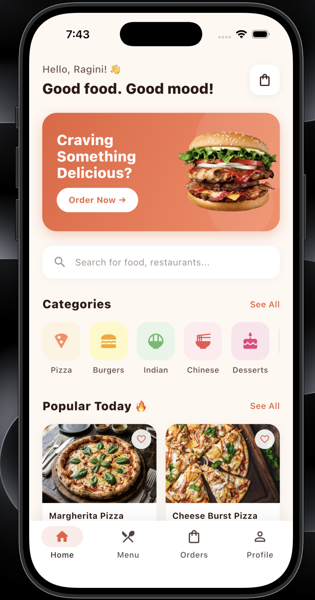
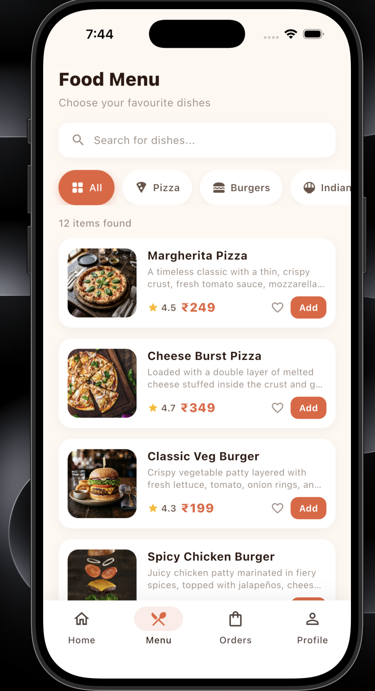
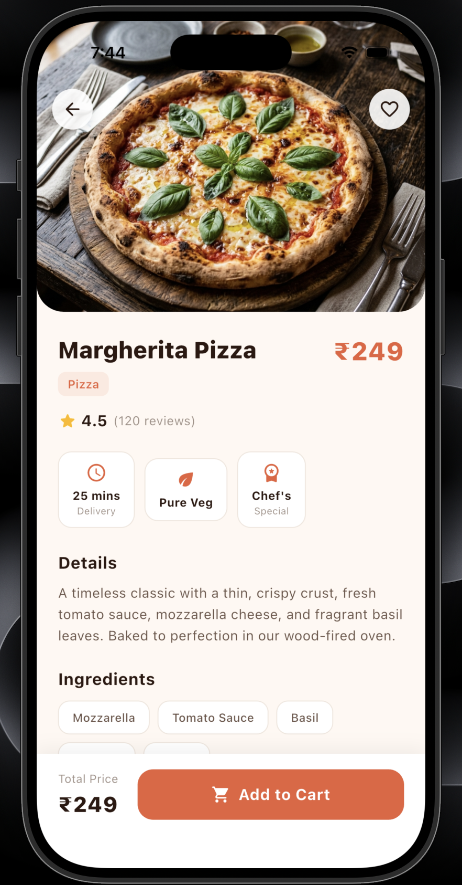
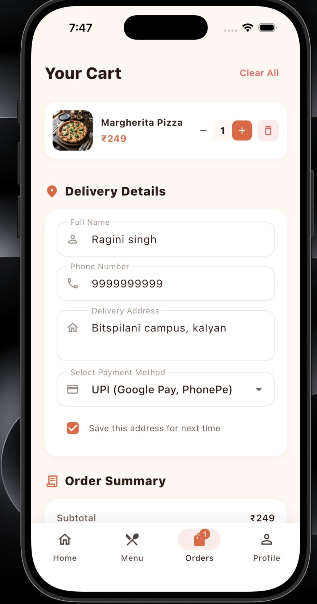

# 🍔 Foodie — Food Ordering App

<p align="center">
  
</p>

<h3 align="center">Delicious Food. Delivered With Love. ❤️</h3>

<p align="center">
  A modern, premium and interactive food ordering mobile application built with Flutter.
</p>

<p align="center">
  
  
  
  
  
</p>

---

## 📌 Project Overview

**Foodie** is a modern food ordering mobile application developed using **Flutter and Dart**.

The application provides a smooth food-ordering experience where users can explore food categories, browse a restaurant menu, view detailed food information, add items to a cart, manage quantities, enter delivery details, select a payment method and place an order.

The project focuses on demonstrating Flutter fundamentals such as:

- Material UI design
- Multi-screen navigation
- Forms and validation
- Local data handling
- Cart management
- Dynamic calculations
- Stateful widgets
- Reusable Flutter widgets

This project is developed as a **Flutter Mini Project for the Food & Restaurant sector**.

---

## ✨ Key Features

### 🏠 Home & Discovery
- Premium food ordering home screen
- Personalized welcome section
- Promotional food banner
- Search interface
- Food categories
- Popular food section
- Cart item badge
- Modern bottom navigation

### 🍕 Food Menu
- Complete food menu
- Multiple food categories
- Category filtering
- Food cards with images
- Ratings and prices
- Add-to-cart functionality
- SnackBar feedback

### 🍔 Food Details
- Large food image
- Food name and category
- Rating and reviews
- Detailed food description
- Ingredients
- Delivery information
- Quantity selector
- Dynamic total price
- Add to Cart button
- Favourite UI

### 🛒 Cart & Checkout
- Added food items
- Increase/decrease quantity
- Remove food items
- Dynamic subtotal
- Delivery fee calculation
- Dynamic grand total
- Delivery details form
- Phone number validation
- Address validation
- Payment method selection
- Save-address checkbox
- Order confirmation dialog
- Cart clearing after successful order

---

# 📱 App Screenshots

## 🖼️ App Showcase

<table>
<tr>
<td width="50%" align="center">

### 🏠 Home



**Explore delicious food, categories and popular dishes.**

</td>

<td width="50%" align="center">

### 🍕 Food Menu



**Browse the menu and filter food by category.**

</td>
</tr>

<tr>
<td width="50%" align="center">

### 🍔 Food Details



**View food details, ingredients, ratings and quantity.**

</td>

<td width="50%" align="center">

### 🛒 Cart & Checkout



**Manage your cart, enter delivery details and place an order.**

</td>
</tr>
</table>

---

## 🛠️ TECH STACK

Flutter
Dart
Material 3
Local Dummy Data
StatefulWidget / setState

━━━━━━━━━━━━━━━━━━━━━━━━━━━━━━━━

## 📂 PROJECT STRUCTURE

lib/
├── models/
├── screens/
├── widgets/
└── main.dart

assets/
└── images/


# 🧭 Application Flow

```text
                    ┌───────────────┐
                    │   🏠 HOME     │
                    └───────┬───────┘
                            │
                            ▼
                    ┌───────────────┐
                    │  🍕 MENU      │
                    └───────┬───────┘
                            │
                            ▼
                    ┌───────────────┐
                    │ 🍔 DETAILS    │
                    └───────┬───────┘
                            │
                            ▼
                    ┌───────────────┐
                    │ 🛒 CART       │
                    │  & CHECKOUT   │
                    └───────┬───────┘
                            │
                            ▼
                    ┌───────────────┐
                    │ 🎉 CONFIRMED  │
                    └───────────────┘
```

## 🎯 PROJECT HIGHLIGHTS

✓ 4 Interactive Screens
✓ Functional Navigation
✓ Dynamic Cart
✓ Category Filtering
✓ Form Validation
✓ Dynamic Pricing
✓ Local Food Images
✓ Responsive Mobile UI

━━━━━━━━━━━━━━━━━━━━━━━━━━━━━━━━

## 🚀 RUN LOCALLY

flutter pub get
flutter run

━━━━━━━━━━━━━━━━━━━━━━━━━━━━━━━━

## 🎓 MINI PROJECT

Food & Restaurant Sector 🍔🍕
Flutter Mini Project


## 👩‍💻 AUTHOR
Ragini Singh
